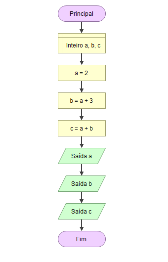

# Fluxograma-with-Programming

Apresentação gráfica de um algoritmo 

Talvez, usar o fluxograma como uma das primeiras ferramentas, para programar, não seja a melhor ideia.

Mas de certa forma, é um bom jeito para entender melhor como funciona um algoritmo, para resolver algum problema!

Acima há um exemplo de fluxograma, bem simples! No caso, estou declarando 3 variaveis do tipo **int**
*a*, *b* e *c*. 

Depois atribuo valores a essas variaveis. E na saida de dados, coloco para mostrar o valores atribuidos.

Simplificando: 
Em um programa há a entrada de dados e a saida de dados, como nesse meio termo há o processamento desses dados. O fluxograma
apenas mostrou isso, acontecendo em forma de graficos.

O resultado da saida: 

Nos arquivos, estão um calculo de IMC (Índice de Massa Corporal).

O legal do programa **Flowgorithm**, ele traduz o pseudocodigo em codigo de Linguagem de Programação, como Java, JavaScript, C# e entre outros....

Então além do IMC em fluxograma, tem o mesmo calculo, só que em Java, JavaScript e em C#, como complemento.

O programa também está disponível nesse repositório...
